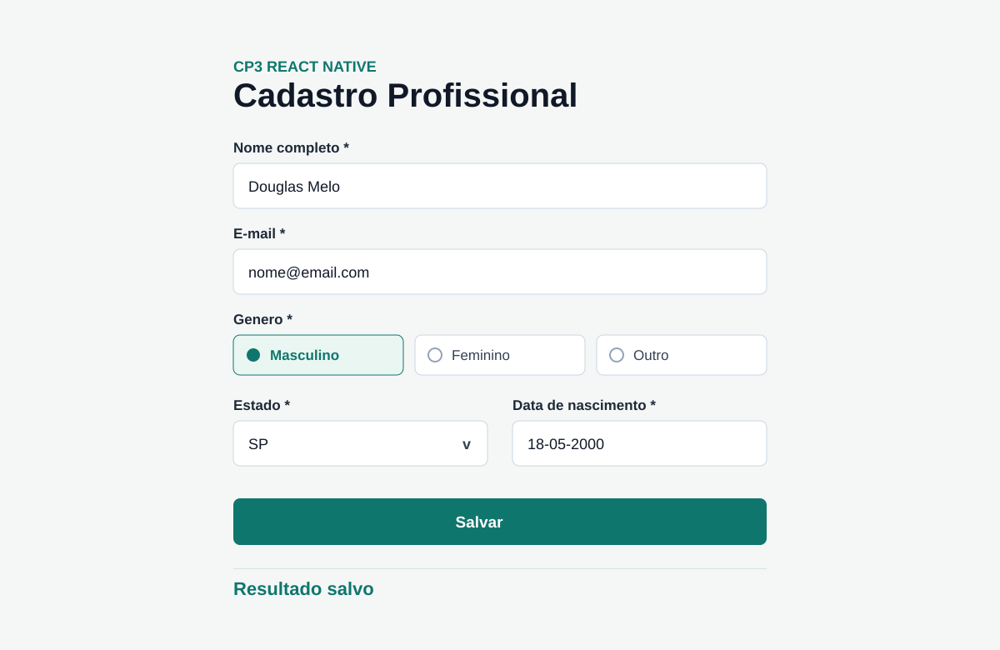

# CP3 Dynamic Forms

Aplicativo mobile em React Native com Expo SDK 55 que gera um formulario dinamico a partir de um arquivo JSON. O app identifica o tipo de cada campo, renderiza o componente correto, valida campos obrigatorios, salva os dados no AsyncStorage, recupera os dados ao abrir e permite limpar o cadastro.

## Tecnologias utilizadas

- React Native
- Expo SDK 55
- TypeScript
- AsyncStorage
- React Native Web

## Como executar o projeto

```bash
npm install
npx expo start
```

Para executar no navegador:

```bash
npx expo start --web
```

Tambem estao disponiveis:

```bash
npm run android
npm run ios
npm run web
npm run typecheck
```

## Prints da aplicacao



## Estrutura de pastas

```txt
src/
  components/
  config/
  hooks/
  screens/
  services/
  types/
  utils/
```

## Funcionalidades

- Formulario gerado por `src/config/formConfig.ts`
- Campos `text`, `email`, `password`, `number`, `textarea`, `select`, `combo`, `radio`, `checkbox`, `switch` e `date`
- Validacao de obrigatorios, e-mail, numero e data
- Persistencia local com AsyncStorage
- Resultado exibido apos submit
- Compatibilidade com Android, iOS e Web via Expo

## Integrantes

- Douglas Melo - RM A INFORMAR
